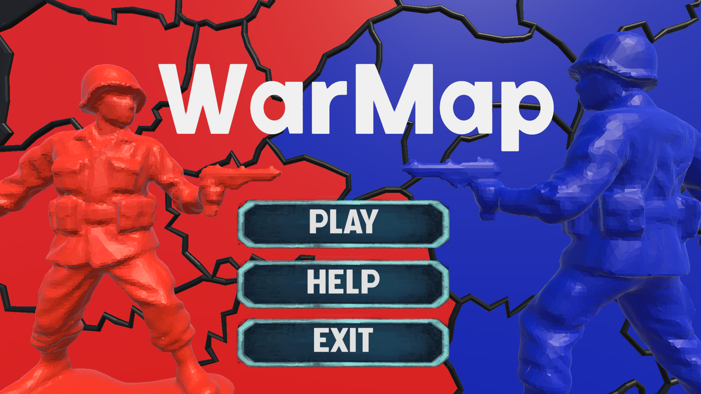

# WarMap ⚔️



## 📖 Índice

1. [Introducción](#-introducción)
2. [Cómo Ejecutar el Juego](#-cómo-ejecutar-el-juego)
3. [Fases del Turno](#-fases-del-turno)
   - [Fase de Refuerzo](#1-fase-de-refuerzo-)
   - [Fase de Ataque](#2-fase-de-ataque-️)
   - [Fase de Defensa](#3-fase-de-defensa-️)
4. [Lógica del Juego](#-lógica-del-juego)
5. [Objetos Modelados](#-objetos-modelados)
6. [Ampliaciones Futuras](#-ampliaciones-futuras)
6. [Referencias](#-referencias)

---

## 🎯 Introducción

**WarMap** es un juego de estrategia por turnos inspirado en el clásico juego de mesa **RISK**. El objetivo del juego es conquistar todo el mapa eliminando al ejército enemigo mediante estrategia, gestión de tropas y combates tácticos.

El juego está ambientado en el **mapa de España**, donde dos jugadores (Azul y Rojo) compiten por el control de las diferentes comunidades autónomas. Cada jugador debe gestionar sus tropas, planificar ataques y defender sus territorios para lograr la victoria total.

### Características principales:
- 🎲 Sistema de dados para determinar refuerzos
- 🗺️ Mapa interactivo de España con provincias
- ⚔️ Sistema de combate visual con animaciones
- 🏆 Bonus regionales por conquistar comunidades autónomas completas
- 👥 Modo 2 jugadores (turnos alternos)

---

## 🎮 Cómo Ejecutar el Juego

1. Descomprimir el archivo `exe.zip` ubicado en la carpeta raíz del proyecto
2. Navegar a la carpeta descomprimida
3. Ejecutar el archivo **`WarMap.exe`**

> **Requisitos:** Windows 10/11, Linux

---

## 🔄 Fases del Turno

Cada turno en WarMap se divide en **tres fases** que el jugador debe completar de manera secuencial. Usa la tecla **ESPACIO** para avanzar entre fases.

### 1. Fase de Refuerzo 🎲

En esta fase el jugador obtiene tropas adicionales para reforzar sus territorios.

**¿Cómo funciona?**
1. Haz clic en tu dado (Azul o Rojo según tu turno)
2. El dado se lanzará y mostrará un número del 1 al 6
3. Recibirás ese número de tropas + bonus regionales (si controlas regiones completas)
4. Haz clic en una de tus provincias para desplegar todas las tropas de refuerzo

**Sistema de Bonus Regional:**
| Región | Bonus |
|--------|-------|
| Extremadura | +1 |
| Comunidad Valenciana, Aragón, País Vasco | +2 |
| Galicia, Cataluña | +3 |
| Castilla-La Mancha | +4 |
| Andalucía | +5 |
| Castilla y León | +6 |

📹 **Video Tutorial - Fase de Refuerzo:**

https://github.com/user-attachments/assets/6967876e-0ce8-4613-9016-094c6fde238a

---

### 2. Fase de Ataque ⚔️

En esta fase puedes atacar provincias enemigas adyacentes para expandir tu territorio.

**¿Cómo funciona?**
1. **Clic izquierdo** en una de tus provincias para seleccionarla (se pondrá verde)
2. **Clic derecho** en una provincia enemiga **vecina** para atacarla
3. Se activará una animación de combate entre soldados
4. El resultado se calcula comparando el número de tropas:
   - Si el atacante tiene más tropas → **Gana** y conquista el territorio
   - Si el defensor tiene igual o más tropas → **El defensor resiste**
5. Para terminar la fase de Ataque se debe presionar el botón de **ESPACIO**

**Reglas del combate:**
- Necesitas al menos **2 tropas** en una provincia para atacar desde ella
- Solo puedes atacar provincias **vecinas** (adyacentes)
- Las bajas se calculan restando tropas del perdedor

📹 **Video Tutorial - Fase de Ataque:**

https://github.com/user-attachments/assets/14bd967d-6415-4780-b5da-c619ac52f440


---

### 3. Fase de Defensa 🛡️

También conocida como fase de **fortificación** o **movimiento de tropas**. Permite reorganizar tus fuerzas.

**¿Cómo funciona?**
1. **Clic izquierdo** en una de tus provincias para seleccionarla
2. **Clic derecho** en otra provincia **tuya y vecina** para mover 1 tropa
3. Puedes repetir este proceso varias veces para mover más tropas
4. Presiona **ESPACIO** para terminar tu turno

**Estrategia:**
- Fortalece las fronteras con el enemigo
- No dejes provincias con pocas tropas vulnerables a ataques

📹 **Video Tutorial - Fase de Defensa:**

https://github.com/user-attachments/assets/dbc64016-e576-4780-90bd-13eebbff53fd

---

## 🧠 Lógica del Juego

### Sistema de Provincias Vecinas

Cada provincia tiene definida una lista de **provincias vecinas** (`List<Provincia> vecinos`). Esta relación de adyacencia es fundamental porque:

- **Ataques:** Solo puedes atacar provincias que estén en tu lista de vecinos
- **Movimientos:** Solo puedes mover tropas a provincias vecinas que te pertenezcan
- **Validación:** El sistema verifica con `vecinos.Contains(objetivo)` si una acción es válida

### Cálculo de Combate

El sistema de combate es determinista basado en la **superioridad numérica**:

```
FuerzaAtacante = Tropas en provincia atacante
FuerzaDefensor = Tropas en provincia defensora

Si FuerzaAtacante > FuerzaDefensor:
    → Atacante GANA
    → Supervivientes = FuerzaAtacante - FuerzaDefensor
    → Atacante mantiene 1 tropa, el resto conquista el territorio
    
Si FuerzaAtacante ≤ FuerzaDefensor:
    → Defensor GANA
    → Supervivientes = FuerzaDefensor - FuerzaAtacante
    → Atacante queda con 1 tropa
```

### Gestión de Estados del Juego

El juego maneja tres estados principales mediante un `enum`:

1. **Preparación:** Los jugadores eligen sus provincias iniciales (+2 tropas por turno, 10 turnos)
2. **Jugando:** Ciclo normal de fases (Refuerzo → Ataque → Defensa)
3. **GameOver:** Un jugador ha conquistado todas las provincias del enemigo

### Sistema de Visualización de Combate

Cuando ocurre un ataque entre provincias con dueño:
1. Se activa la **BattleCamera** con transición suave
2. Se instancian dos soldados (atacante y defensor) en el centro del combate
3. El soldado perdedor **explota** en piezas con física de Rigidbody
4. La cámara regresa a la vista principal

## 🎨 Objetos Modelados

Los siguientes modelos 3D fueron creados específicamente para este proyecto:

| Objeto | Archivo | Descripción |
|--------|---------|-------------|
| 🎲 Dado Azul | `dadoAzul.fbx` | Dado 3D para el jugador azul |
| 🎲 Dado Rojo | `dadoRojo.fbx` | Dado 3D para el jugador rojo |
| 🧍 Soldado | `soldadoR.fbx` | Modelado de las animaciones del soldado |
| 🗺️ Mapa de España | `spain.fbx` | Mapa 3D de España dividido en provincias |

Estos modelos se encuentran en la carpeta `Assets/Prefabs/`.

## 🚀 Ampliaciones Futuras

El desarrollo de WarMap no termina aquí. Estas son las mejoras y características planeadas para futuras versiones:

### 🗺️ Nuevos Mapas
- **Mapa de Europa:** Expandir el campo de batalla a todo el continente europeo con sus diferentes regiones y bonus específicos
- **Mapa Mundial:** Un mapa global con todos los continentes, océanos y zonas estratégicas

### 👥 Modo Multijugador
- **3-4 jugadores simultáneos:** Partidas épicas con múltiples facciones compitiendo
- **IA con diferentes niveles de dificultad:** Desde principiante hasta experto en el caso de jugar en solitario.


---

## 📚 Referencias

- **Inspiración principal:** [RISK](https://store.steampowered.com/app/1128810/RISK_Global_Domination/?l=latam)
- **Motor de juego:** [Unity](https://unity.com/)
- **Render Pipeline:** Universal Render Pipeline (URP)
- **Modelado del soldado:** [soldado](https://sketchfab.com/3d-models/army-men-green-soldier-66351cbe5e6a4e3fb00fc7e6465346e0)
---

## 🎓 Información Académica

- **Asignatura:** Fundamentos Computacionales de los Videojuegos
- **Proyecto:** WarMap 
- **Tutor:** Guil Asensio, Francisco de Asis
- **Alumno:** Labied Nasser, Mohammed Amrou 
---

*¡Buena suerte conquistando España!* 🏰


